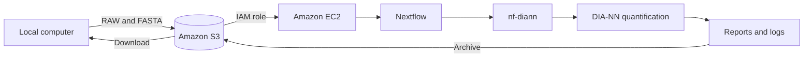

# Proteomics Automated Quantification on AWS

A reproducible S3-to-EC2 workflow for automated DIA proteomics quantification with Nextflow, nf-diann, and DIA-NN.

## Links

- [Step-by-step tutorial](docs/tutorial.md)
- [Published demonstration dataset and results](https://doi.org/10.5281/zenodo.23065890)
- [Upstream nf-diann workflow](https://github.com/lehtiolab/nf-diann)
- [DIA-NN](https://github.com/vdemichev/DiaNN)
- [Nextflow](https://www.nextflow.io/)
- [License](LICENSE)
