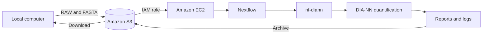

# Automated Proteomics(DIA) Quant: Cloud Platform Engineering

This project presents a **reproducible cloud-based workflow for automated DIA proteomics quantification** using AWS, Nextflow and DIA-NN. By automating data processing, workflow execution, and result generation, the framework **reduces manual intervention, minimizes processing errors, improves reproducibility, and enables consistent analysis across large proteomics datasets**. The approach provides a scalable foundation for standardized and efficient high-throughput proteomics analysis.

## Links

- [Step-by-step tutorial](docs/tutorial.md)
- [Published demonstration dataset and results at Zenodo](https://doi.org/10.5281/zenodo.23065890)
- [Upstream nf-diann workflow](https://github.com/lehtiolab/nf-diann)
- [DIA-NN](https://github.com/vdemichev/DiaNN)
- [Nextflow](https://www.nextflow.io/)
- [License](LICENSE)
