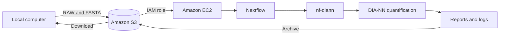

# Automated Proteomics(DIA) Quant

This repo presents a reproducible cloud-based workflow for automated DIA proteomics quantification using AWS, Nextflow and DIA-NN. By automating data processing, workflow execution, and result generation, the framework reduces manual intervention, minimizes processing errors, improves reproducibility, and enables consistent analysis across large proteomics datasets. The approach provides a scalable foundation for standardized and efficient high-throughput proteomics analysis.

